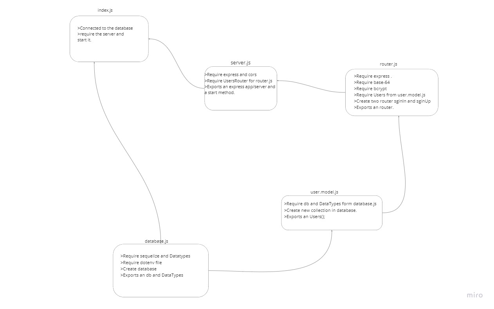

# basic-auth
**an Express server that implements Basic Authentication, with signup and signin capabilities, using a Postgres database for storage.**

# lab summary :

* created an express  sever and exported the app and the start function .

* created a model for the user , has username and the password.

* created an index.js model for the seqluelize requiring , i 
required the user's model and the sequlize with the datatypes.

* inside index.js model i created a new instance of sequelize to connect between the databaseurl and the sequelize option. and exported the model after creating it ,and exported the sequalize instance.

* created the signin and signup routes in user.js file.

* in the signup route i hashed the password and send the username and the password to the body.

* in sign in i had a middleware called (basicAuth) which takes the req,res,next, then it decoded the encoded username and password if the password for this usename matches the sign in credentials it will give the user the autherization to sign in else it will tell it's an invalid error.

##  UML diagram :

## Links :
* [heroku app]()
* [pull request link]()
* [ Actions link]()
